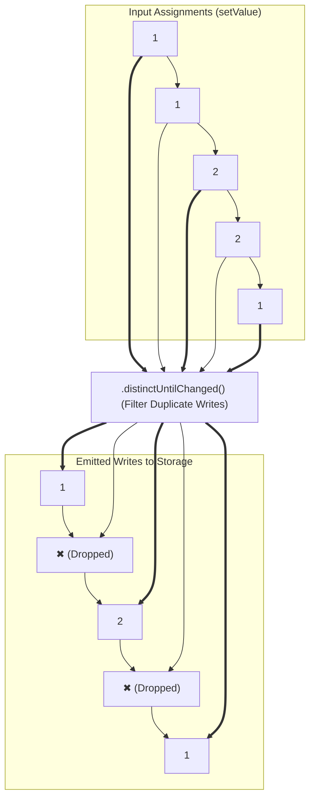
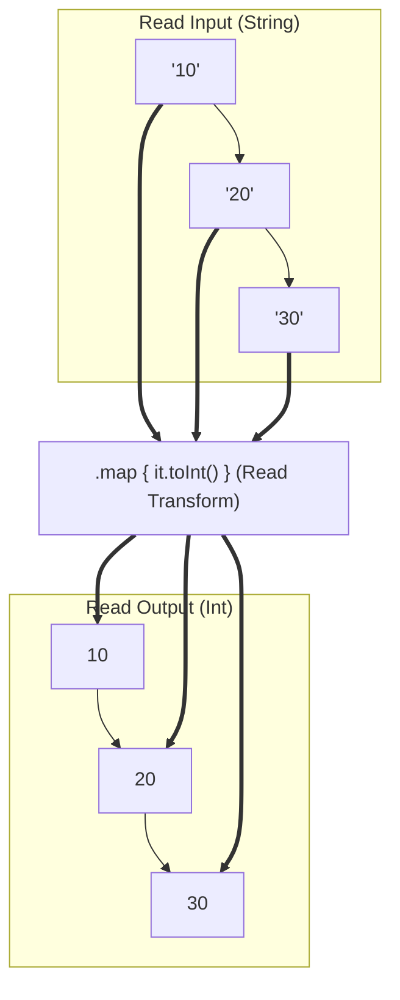
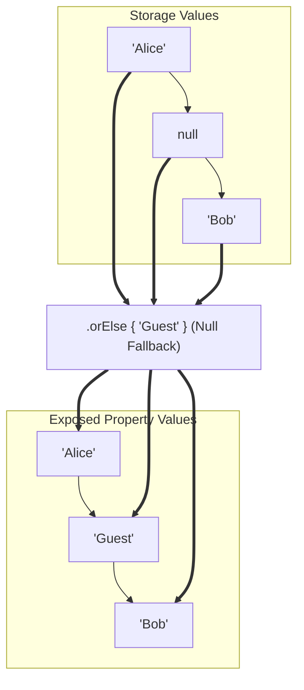

<p align="center">
  
</p>

# RePropertyX

<p align="left">
  <a href="https://jitpack.io/#RePropertyX/RePropertyX"></a>
  <a href="https://javadoc.jitpack.io/com/github/RePropertyX/RePropertyX/repropertyx/1.1.0/javadoc/"></a>
  <a href="https://javadoc.jitpack.io/com/github/RePropertyX/RePropertyX/repropertyx-android/1.1.0/javadoc/"></a>
  <a href="https://javadoc.jitpack.io/com/github/RePropertyX/RePropertyX/repropertyx-compose-android/1.1.0/javadoc/"></a>
  <a href="https://repropertyx.github.io/RePropertyX/"></a>
  <a href="https://github.com/RePropertyX/RePropertyX/actions"></a>
  <a href="https://kotlinlang.org"></a>
  <a href="https://developer.android.com"></a>
  <a href="https://developer.android.com/jetpack/compose"></a>
  <a href="LICENSE"></a>
</p>

A **Kotlin-first property delegation toolkit** that makes your code cleaner, safer, and more expressive.

RePropertyX brings the power of Kotlin's `ReadWriteProperty` and `provideDelegate` features to life by letting you easily build **reactive, composable, and testable property delegates**.

---

## 🚀 Why RePropertyX?

Instead of manually writing boilerplate `get` / `set` logic for properties, RePropertyX lets you:

- **Compose delegates** just like functional streams: `.map()`, `.distinctUntilChanged()`, `.onEach()`
- **Animate values** with `.animated()` — no more writing manual `ValueAnimator` code.
- **Store state safely** with `bySharedPreferences()` delegates.
- **Write tests with confidence** — small, composable delegates are easy to mock.

---

## 📦 Installation

Add JitPack to your project repository list:

```kotlin
// settings.gradle.kts
dependencyResolutionManagement {
    repositories {
        maven { url = uri("https://jitpack.io") }
    }
}
```

Add dependencies to your module's `build.gradle.kts`:

```kotlin
dependencies {
    // Core JVM property delegates
    implementation("com.github.RePropertyX.RePropertyX:repropertyx:1.1.0")

    // Android extensions (SharedPreferences, View animations)
    implementation("com.github.RePropertyX.RePropertyX:repropertyx-android:1.1.0")

    // Compose extensions (MutableState & Compose bindings)
    implementation("com.github.RePropertyX.RePropertyX:repropertyx-compose-android:1.1.0")
}
```

---

## 🌐 Website & Documentation

- 🚀 **Official Website & Interactive Guides**: [repropertyx.github.io/RePropertyX](https://repropertyx.github.io/RePropertyX/)
- 📖 **Multi-Module Dokka API Reference**: [repropertyx.github.io/RePropertyX/api](https://repropertyx.github.io/RePropertyX/api)

---

## ✨ Quick Example

### Before RePropertyX

```kotlin
val prefs = context.getSharedPreferences("user", MODE_PRIVATE)
var userToken: String?
    get() = prefs.getString("user_token", null)
    set(value) { prefs.edit().putString("user_token", value).apply() }
var userNickname: String
    get() = prefs.getString("userNickname_${userToken}", null) ?: "unknown"
    set(value) { prefs.edit().putString("userNickname_${userToken}", value).apply() }
```

### After RePropertyX

```kotlin
var userToken: String? by prefs.byString()
var userNickname: String by prefs.byString { "${it}_${userToken}" }.orElse { "unknown" }

// Batch mutations directly on SharedPreferences.Editor!
prefs.edit().apply {
    var username: String? by byString()
    username = "Andrew"
}.apply()
```

Or fully reactive:

```kotlin
var peekHeight by propertyOf(
    get = { bottomSheetBehavior.peekHeight },
    set = { bottomSheetBehavior.peekHeight = it },
)
.distinctUntilChanged()
.animated()
.onEach { println("PeekHeight changed to $it") }

peekHeight = 200 // smooth animation + event callback!
```

---

## 💡 Key APIs

| Module | API | Description |
|---|---|---|
| **Core** | `propertyOf(get, set)` | Create a property delegate from any getter & setter pair. |
| **Core** | `mutablePropertyOf(initial)` / `V.asProperty()` | Create an in-memory mutable property delegate. |
| **Core** | `.map(to, from)` | Transform values between exposed and stored types. |
| **Core** | `.orElse { fallback }` / `.notNull()` | Provide a fallback value or throw an exception when the delegate returns null. |
| **Core** | `.distinctUntilChanged()` | Prevent redundant writes (`setValue`) when assigned value is unchanged. |
| **Core** | `.onEach { }` / `.onEachBefore { }` | Observe changes or run side effects before/after assignment. |
| **Core** | `.closable()` | Automatically close `AutoCloseable` resources upon replacing. |
| **Core** | `byThreadLocal { ... }` | Type-safe `ThreadLocal` property delegation. |
| **Core** | `byAtomic()` / `0.byAtomic()` | Thread-safe `AtomicReference`, `AtomicInteger`, etc. delegation. |
| **Core** | `byDeclaredField` / `byFirstDeclaredField` | Reflection field access with optional field caching. |
| **Core** | `.switchMap()` / `.flatMap()` | Delegate dynamically to child properties based on parent value. |
| **Core** | `StateFlow.getValue()` / `MutableStateFlow.setValue()` | Direct Kotlin Coroutines `StateFlow` property delegation. |
| **Core** | `.cached(maxAge, maxStale, forceCache)` | HTTP-style caching mechanism (`maxAge`, `maxStale`, `forceCache`, `invalidate()`). |
| **Core** | `.clamp(min, max)` | Clamp numerical write values within min..max range. |
| **Core** | `.validateIf { predicate }` | Conditionally allow or skip write operations based on a predicate. |
| **Core** | `.withHistory(maxSize)` | Attach undo/redo stack (`.undo()`, `.redo()`) to any property delegate. |
| **Core** | `.expiringIn(ttlMillis)` | Automatically expire and return `null` after TTL duration. |
| **Android** | `savedStateHandle.byProperty(key, default)` | Delegate to Android `SavedStateHandle` for Process Death survival. |
| **Android** | `bySharedPreference`, `byString`, `byInt`, ... | Type-safe Android `SharedPreferences` property delegates. |
| **Android** | `.animated()` | Animate View numerical properties with `ValueAnimator`. |
| **Android** | `view.animatedFloatAwait(value)` | Suspend function animating View properties asynchronously. |
| **Compose** | `rememberProperty { ... }` | Remember property delegates inside Jetpack Compose UI. |
| **Compose** | `rememberPropertyState` + `changesComposed()` | Auto-recompose Compose UI when `SharedPreferences` change on disk. |

---

## ⚡ Feature Comparisons (Before vs. After)

### 5. 📦 Rich Cache Control (`.cached(maxAge, maxStale, forceCache)`)

**❌ Traditional (Manual Cache Controls):**
```kotlin
private var cachedConfig: Config? = null
private var cachedAt: Long = 0L

fun getConfig(): Config {
    val now = System.currentTimeMillis()
    if (cachedConfig != null && (now - cachedAt <= 300_000)) {
        return cachedConfig!!
    }
    cachedConfig = parseConfigFromDisk()
    cachedAt = now
    return cachedConfig!!
}
```

**✅ RePropertyX:**
```kotlin
// HTTP-style cache control (maxAge = 5m, maxStale = 10m, invalidate, forceCache)
val configProp = propertyOf(get = { parseConfigFromDisk() }, set = {})
    .cached(maxAgeMillis = 5.minutes, maxStaleMillis = 10.minutes)

var config: Config by configProp

// Force invalidate cache to re-parse on next read:
configProp.invalidate()
```

---

### 1. 🛡️ Bounds Clamping & Validation (`.clamp()`, `.validateIf()`)

**❌ Traditional (Manual Setters):**
```kotlin
private var _volume = 50
var volume: Int
    get() = _volume
    set(v) { _volume = v.coerceIn(0, 100) }
```

**✅ RePropertyX:**
```kotlin
var volume: Int by mutablePropertyOf(50).clamp(min = 0, max = 100)
```

---

### 2. ↩️ Undo / Redo History Stack (`.withHistory()`)

**❌ Traditional (Manual Stacks):**
```kotlin
private val history = mutableListOf<String>()
private var index = -1

fun updateText(v: String) { history.add(v); index++ }
fun undo() { if (index > 0) index-- }
```

**✅ RePropertyX:**
```kotlin
val textProp = mutablePropertyOf("Hello").withHistory(maxSize = 10)
var text: String by textProp

text = "World"
textProp.undo() // Instantly reverts back to "Hello"!
```

---

### 3. ⏳ TTL Auto-Expiry Caching (`.expiringIn()`)

**❌ Traditional (Manual Timestamps):**
```kotlin
private var token: String? = null
private var lastFetchTime = 0L

fun getToken(): String? {
    return if (System.currentTimeMillis() - lastFetchTime > 300_000) null else token
}
```

**✅ RePropertyX:**
```kotlin
var token: String? by delegate<String?>("session_token").expiringIn(5.minutes)
```

---

### 4. 📱 Android SavedStateHandle Process Death (`savedStateHandle.byProperty()`)

**❌ Traditional (Manual SavedStateHandle):**
```kotlin
var query: String
    get() = savedStateHandle.get<String>("query") ?: ""
    set(v) { savedStateHandle["query"] = v }
```

**✅ RePropertyX:**
```kotlin
var query: String by savedStateHandle.byProperty("query", default = "")
    .distinctUntilChanged()
    .onEach { log(it) }
```

---

## 🔀 Bi-Directional Operator Pipeline

ReProperty delegates act as bi-directional reactive pipelines. Operators independently transform and filter values along the **Read (`getValue`)** and **Write (`setValue`)** paths.

### 🔮 Operator Marble Diagrams (Rx-Style)

#### 1. `.distinctUntilChanged()` — Suppress Duplicate Writes (`setValue`)



---

#### 3. `.map(readTransform, writeTransform)` — Bi-Directional Transformation



---

#### 4. `.orElse { fallback }` — Null Fallback Stream



---

## 🔧 Advanced Usage

### 1. Thread-Safe & Concurrent Delegates

```kotlin
// ThreadLocal delegation
var userSession by byThreadLocal { Session() }

// Atomic delegation
var counter by 0.byAtomic()
counter++ // Atomic update
```

### 2. Animated View Delegation (Coroutines & Animators)

```kotlin
// Property assignment triggers animation
var translationY by view.animatedTranslationY()
translationY = 200f // Smooth 300ms animation

// Suspend animation in Coroutines
lifecycleScope.launch {
    view.animatedFloatAwait(
        value = 300f,
        get = { translationY },
        set = { translationY = it }
    )
}
```

### 3. Jetpack Compose Reactive State

```kotlin
@Composable
fun UserSettingsScreen(prefs: SharedPreferences) {
    // Automatically triggers Compose recomposition when SharedPreferences change!
    var darkMode by rememberPropertyState(
        disposable = prefs.changesComposed()
    ) { prefs.byBoolean("dark_mode") }

    Switch(checked = darkMode ?: false, onCheckedChange = { darkMode = it })
}
```

### 4. Dynamic Delegation with switchMap & flatMap

```kotlin
var activeTab by propertyOf(TabType.MAIN)
    .switchMap(
        childProperty = { tabType ->
            when (tabType) {
                TabType.MAIN -> mainContent.by(::content)
                TabType.SETTINGS -> settingsContent.by(::content)
            }
        }
    )
```

---

## ✅ Testing & Quality

RePropertyX ships with comprehensive unit tests covering core delegation logic and SharedPreferences behaviors.
This ensures your code stays predictable and maintainable.

---

## 🤝 Contributing

Contributions are welcome!

- Open issues for bugs and feature requests.
- Submit PRs with tests to keep coverage strong.

---

## 📄 License

Apache 2.0 - see [LICENSE](LICENSE) for details.

---

RePropertyX helps you **think in terms of property semantics** instead of boilerplate — making your Kotlin code more declarative, maintainable, and fun.
