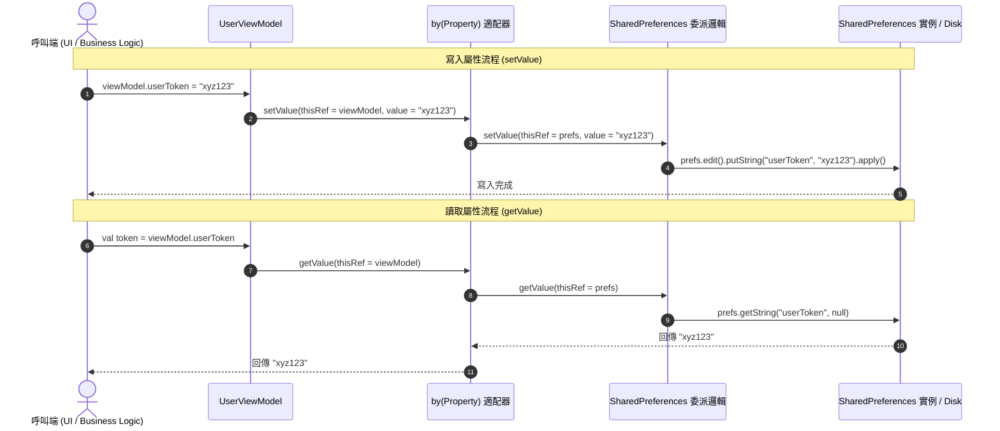

# 🔗 RePropertyX 核心哲學：`by(Property)` 的設計用意與全景指南

在 Kotlin 的原生屬性委派（Property Delegation）機制中，委派物件（`ReadWriteProperty<T, V>`）嚴格受限於 `thisRef` 的接收者型態 `T`。這個設計雖然保證了型別安全，卻也在跨物件組合、層級抽象與動態綁定時帶來了嚴重的語法阻礙。

`RePropertyX` 創新的 **`by(Property)` / `object.by(property)`** 語法，正是為了解決 Kotlin 屬性委派中的**接收者類型限制（Receiver Constraint）**與**物件解耦痛點**而生。

---

## 🎯 1. 痛點與發明用意（Design Intent）

### ❌ 傳統 Kotlin 屬性委派的侷限
假設我們編寫了一個專門為 `SharedPreferences` 設計的委派工具，其型別為 `ReadWriteProperty<SharedPreferences, String?>`：

```kotlin
// 受限於接收者型別必須為 SharedPreferences
class PreferenceDelegate : ReadWriteProperty<SharedPreferences, String?> { ... }
```

當你想在 `UserViewModel` 中直接委派屬性時，Kotlin 編譯器會直接報錯：
```kotlin
class UserViewModel(val prefs: SharedPreferences) {
    // ❌ 編譯錯誤：thisRef 是 UserViewModel，而不是 SharedPreferences！
    var userToken: String? by PreferenceDelegate() 
}
```

為了繞過這個限制，傳統做法只有兩種：
1. **寫滿手動 Getter/Setter 樣板代碼**。
2. **為每個 Class 包裝一層 Wrapper 類別**，導致物件記憶體開銷增加。

---

### ✅ `by(Property)` 的解法：物件適配器模式（Object Adapter）
`by(Property)` 的核心用意是將一個**特定對象（Target Instance）**與**屬性委派邏輯（Delegate Strategy）**進行**極輕量、零額外物件負擔的動態綁定**。

它將 `ReadWriteProperty<T, V>` 轉化為可隨處使用的 `ReadWriteProperty<Any?, V>`，並在讀寫時自動將對象 `T` 注入為 `thisRef`。

---

## 📐 2. 核心底層實現（Core Implementation）

`by(Property)` 的實現極度精簡，透過 Kotlin 擴充函式與 `inline` 實現零成本抽象：

```kotlin
/**
 * 將特定對象 T 與 ReadWriteProperty<T, V> 進行動態綁定，
 * 轉化為可於任意作用域（如 ViewModel, Activity, 本地變數）使用的 ReadWriteProperty<Any?, V>。
 */
inline fun <reified T, V> T.by(
    property: ReadWriteProperty<T, V>
): ReadWriteProperty<Any?, V> = object : ReadWriteProperty<Any?, V> {

    override fun getValue(thisRef: Any?, property: KProperty<*>): V =
        property.getValue(this@by, property)

    override fun setValue(thisRef: Any?, property: KProperty<*>, value: V) {
        property.setValue(this@by, property, value)
    }
}
```

---

## 🔄 3. 架構與時序圖（Sequence Diagram）

以下展現當你在 `UserViewModel` 存取 `userToken` 屬性時，`by(Property)` 如何作為適配器將呼叫轉發給真正的接收者對象 `SharedPreferences`：



---

## 💻 4. 經典實戰使用方式（Usage Patterns）

### 語法型態 A：`targetObject.by(delegate)`（強對象導向）

將屬性直接委派給某個實例物件：

```kotlin
class UserViewModel(val prefs: SharedPreferences) {
    // prefs.byString() 內部即調用了 prefs.by(bySharedPreferenceString())
    var userToken: String? by prefs.byString()
    
    // 支援閉包與預設值
    var userNickname: String by prefs.byString { "${it}_${userToken}" }.orElse { "unknown" }
}
```

---

### 語法型態 B：`SharedPreferences.Editor` 批次寫入作用域

在 `apply` / `let` 作用域中直接組合批量寫入：

```kotlin
// 透過 Editor.byString() 實現批次 commit/apply
sharedPreferences.edit().apply {
    var username: String? by byString()
    var age: Int by byInt("user_age", default = 18)

    // 這裡的寫入動作全部作用在當前 Editor 上！
    username = "Andrew"
    age = 25
}.apply() // 一次性提交到 Disk
```

---

### 語法型態 C：反射與自訂欄位動態綁定 (`object.by(...)`)

甚至可以將委派作用在任何第三方 Class 實例上：

```kotlin
class Person {
    private var _secret: String = "top_secret"
}

val person = Person()

// 透過 .by(person) 動態存取非公開欄位
var secret: String by person.by(byDeclaredField("_secret"))

println(secret) // 輸出 "top_secret"
secret = "new_secret" // 動態更新 person 實例內部欄位
```

---

## ⚖️ 5. 總結：改善了什麼？

| 比較面向 | 傳統 Kotlin 屬性委派 | RePropertyX `by(Property)` |
|---|---|---|
| **接收者限制** | 必須嚴格匹配 `thisRef: T` | 零限制，任何作用域 `Any?` 均可呼叫 |
| **物件解耦** | 強耦合於特定的 Class 宣告 | 邏輯與物件解耦，隨時動態綁定對象 |
| **程式碼體積** | 需要撰寫大量包裝類別與 Getter/Setter | 1 行點語法即可完成組合與鏈式調用 |
| **執行時期開銷** | 常需創建額外的 Wrapper 物件 | 透過 `inline` 高階函數實現零額外物件開銷 |
