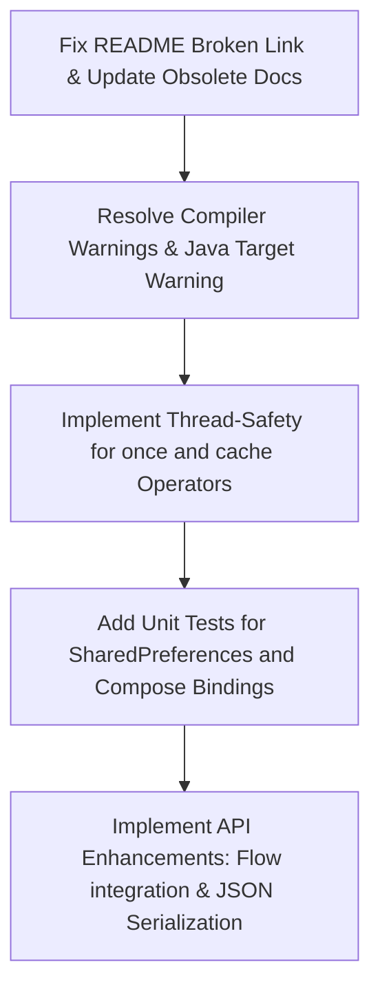

# RePropertyX Project Evaluation & Improvement Plan

RePropertyX is a Kotlin-first property delegation toolkit designed to make property getters, setters, animations, storage, and thread management more expressive, composable, and testable.

Below is a comprehensive evaluation of the project's architecture, code design, and stability, followed by a prioritized list of improvements and actionable recommendations.

---

## 📊 Project Strengths & Architectural Advantages

| Category | Description | Key Implementations |
| :--- | :--- | :--- |
| **Expressive DSL** | RePropertyX wraps Kotlin's `ReadWriteProperty` and `ReadOnlyProperty` in a fluent, chainable API reminiscent of functional streams. | `.orElse()`, `.map()`, `.validate()`, `.distinctUntilChanged()`, `.onEach()`, `.animated()` |
| **Extremely Composable** | Built using the **Decorator Pattern**, where each operator creates a new delegate wrapping the previous one. This maintains strict separation of concerns. | [PropertyX.kt](file:///Users/yongjhih/works/rxproperty/repropertyx/src/main/kotlin/com/github/repropertyx/PropertyX.kt) |
| **Cross-Paradigm Integration** | Seamlessly bridges Android View properties (with animation support via `ValueAnimator`), Jetpack Compose state management, atomic primitives, and thread-local variables. | [ViewPropertyX.kt](file:///Users/yongjhih/works/rxproperty/repropertyx-android/src/main/kotlin/com/github/repropertyx/android/ViewPropertyX.kt), [ComposePropertyX.kt](file:///Users/yongjhih/works/rxproperty/repropertyx-compose-android/src/main/kotlin/com/github/repropertyx/compose/ComposePropertyX.kt), [AtomicPropertyX.kt](file:///Users/yongjhih/works/rxproperty/repropertyx/src/main/kotlin/com/github/repropertyx/AtomicPropertyX.kt) |
| **Powerful Reflection Utilities** | Easily maps class extension properties directly to private/protected/public JVM backing fields. Highly useful for unit testing, legacy libraries, and framework development. | [ReflectPropertyX.kt](file:///Users/yongjhih/works/rxproperty/repropertyx/src/main/kotlin/com/github/repropertyx/ReflectPropertyX.kt) |

---

## 🔍 Areas for Improvement & Actionable Enhancements

### 1. Core Concurrency & Thread-Safety Risks
Several state-bearing operators inside `PropertyX.kt` are not thread-safe. If these properties are accessed or modified concurrently across different coroutines or threads, it can lead to race conditions or memory visibility issues.

*   **`once()` Operator:**
    ```kotlin
    // PropertyX.kt
    fun <P, R> ReadWriteProperty<P, R>.once(): ReadWriteProperty<P, R> {
        return object : ReadWriteProperty<P, R> {
            private var hasBeenSet = false // Non-volatile, unsynchronized flag
            ...
        }
    }
    ```
    *   *Issue:* Multiple threads could read `hasBeenSet` as `false` simultaneously, causing the underlying property to be overwritten multiple times.
    *   *Solution:* Use an `AtomicBoolean` or synchronization block.

*   **`cache()` and `cacheIn()` Operators:**
    *   *Issue:* `cache()` uses a simple non-volatile, unsynchronized backing field `cached: V?`. `cacheIn()` uses a plain `MutableMap<String, Any>` (usually a `HashMap`), which is not thread-safe and can throw `ConcurrentModificationException` under concurrent writes.
    *   *Solution:* Use thread-safe caching strategies, such as `ConcurrentHashMap` or synchronization.

---

### 2. Missing Test Coverage in Submodules
While the JVM core module (`:repropertyx`) has excellent unit tests, other submodules have no active tests.
*   **`:repropertyx-android`**: NO-SOURCE tests executed. No tests for `SharedPreferences` delegates, View extension animations, or lifecycle integrations.
*   **`:repropertyx-compose-android`**: NO-SOURCE tests executed. No tests for `mutableStateOf` bindings, `rememberPropertyState`, or preference change observation.
*   *Action Plan:* Introduce robolectric-based tests in `:repropertyx-android` and Compose UI/State tests in `:repropertyx-compose-android` to ensure stability.

---

### 3. Outdated Documentation and Broken Links
*   **Obsolete References:** `PROJECT_SUMMARY.md` and `TEST_SUMMARY.md` still mention the old project name `delegate-ktx` and outdated package structures (`com.github.yongjhih.delegatektx`).
*   **Broken Link/Accidental Text in README:**
    In [README.md:L87](file:///Users/yongjhih/works/rxproperty/README.md#L87):
    ```markdown
    Allow to write:[[LINE] 與Rin的聊天.txt](..%2F..%2FDownloads%2F%5BLINE%5D%20%E8%88%87Rin%E7%9A%84%E8%81%8A%E5%A4%A9.txt)
    ```
    *   *Issue:* This contains a local file path and chat log reference from a personal Downloads directory.
    *   *Solution:* Clean up the documentation to keep it clean and professional.

---

### 4. Compiler Warnings & Deprecations
The compiler reports several warnings during Gradle builds:
1.  **Parameter Name Mismatch:** In `ComposePropertyX.kt`, the parameter name is declared as `prop` instead of `property`, which violates the supertype `ReadWriteProperty` signature:
    ```kotlin
    // ComposePropertyX.kt
    override fun getValue(thisRef: Any?, prop: KProperty<*>): V
    // Warn: The corresponding parameter in the supertype 'ReadWriteProperty' is named 'property'.
    ```
2.  **Unused Parameters and Variables:** Unused local variable `logEntries` in `PropertyXTest.kt:L118`, unused parameter `property` in `ReflectPropertyXTest.kt:L188`, and unused local variables inside `MainActivity.kt` (`context`, `lastLoginTime`, `maxRetries`).
3.  **Obsolete Java Target:** Roots and examples specify Java compatibility 8, which is obsolete and triggers warnings.

---

### 5. Recommended API Enhancements

> [!TIP]
> Introducing the following API enhancements will greatly improve developer ergonomics and project adoption.

*   **Flow Integration:** Allow developers to easily convert any delegate property to a cold/hot coroutine `Flow` so they can listen to changes reactively.
    ```kotlin
    fun <T, V> ReadWriteProperty<T, V>.asFlow(thisRef: T, property: KProperty<*>): Flow<V>
    ```
*   **Built-in JSON Serialization:** `serialized()` is highly powerful, but currently requires passing custom lambda functions. Adding pre-built serializers (e.g. using `kotlinx.serialization` or `Gson`) would allow:
    ```kotlin
    var userProfile: UserProfile by prefs.byString().serializedJson<UserProfile>()
    ```
*   **SharedPreferences Default Values:** Provide default values directly in the factory functions instead of chaining `.orElse {}` or `.orNull()`:
    ```kotlin
    fun SharedPreferences.byString(key: String? = null, default: String = "")
    ```

---

## 🛠️ Proposed Step-by-Step Execution Plan



### Phase 1: Clean Up & Quick Wins (Immediate)
*   Remove the broken link in [README.md](file:///Users/yongjhih/works/rxproperty/README.md) and update obsolete project/package names in `PROJECT_SUMMARY.md` / `TEST_SUMMARY.md`.
*   Rename parameter names in `ComposePropertyX.kt` from `prop` to `property` to eliminate all parameter name mismatch compiler warnings.
*   Clean up unused variables in test files and `MainActivity.kt`.

### Phase 2: Core Improvements (Thread Safety & Quality)
*   Refactor the `once()` operator in `PropertyX.kt` using `java.util.concurrent.atomic.AtomicBoolean`.
*   Refactor the `cache()` and `cacheIn()` operators to use thread-safe locks or concurrent maps.
*   Write unit tests for the Android and Compose modules.

### Phase 3: Developer Experience (Feature Expansion)
*   Add Flow-conversion helper extension functions.
*   Add JSON serialization delegation utilities.
